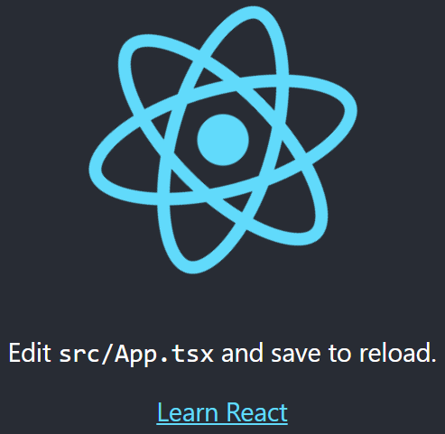

[« introduction](README.md) | [next »](02-routing.md)

## 1. Setup from scratch

There exist several ways to create a React app. 
The most common way is to use the [create-react-app](https://reactjs.org/docs/create-a-new-react-app.html) from facebook itself.
It is a perfect fit for single page apps. 
There are other use cases where a solution like [NextJs by Vercel](https://nextjs.org/learn/basics/create-nextjs-app/setup) might fit better,
e.g. the requirement of SEO with server side rendering. NextJs requires Node on the production server, create-react-app does not.
In this tutorial we go with [create-react-app](https://reactjs.org/docs/create-a-new-react-app.html) because it fits our needs.

[Create-react-app](https://reactjs.org/docs/create-a-new-react-app.html) is built with the [webpack](https://webpack.js.org/)
bundler which supports several [loaders](https://webpack.js.org/loaders/).
Webpack loaders do transpile newer javascript or event typescript to older javascript (e.g. ES5)
which is readable for all browsers.
Not only Webpack handles the transpiling, it also supports hot reloading, code splitting and finally the bundling of your
production app. So Webpack takes care of a lot of stuff which makes our life much easier.

### 1.1 Installation
[create-react-app.dev](https://create-react-app.dev) makes it stunningly fast to start a new react project.
The only thing you need todo is to open your console and create a new project folder by executing the command below.
This command is going to download the typescript starter template for new react apps.

```console
npx create-react-app my-project --template typescript
```
This one might take a few minutes.

As soon as the installation process is finished, you can test if everything works by starting the app.
To start the app you can open the recently created `package.json` and execute the `start` script by clicking the green "play" button.
Alternatively you can execute the script with `npm start` directly from your console (`cd my-project`, `npm start`).
Now you should be able to see the following content in your browser at `localhost:3000`.

*http://localhost:3000*


Yay! You've just started the app in the dev mode.
Your code changes are going to be hot reloaded in the browser,
no need to refresh the page after saving your files.
Thanks to webpack and create-react-app. Awesome!

### 1.2 Time to commit, but...
...before we make our first commit, let's add an entry to the recently created `.gitignore` file to prevent committing our
IDE files. Add a new line `.idea/` in case of a JetBrains IDE (e.g. WebStorm or PhpStorm) or
`.vscode/` if you use Visual Studio Code.

[« introduction](README.md) | [next »](02-routing.md)